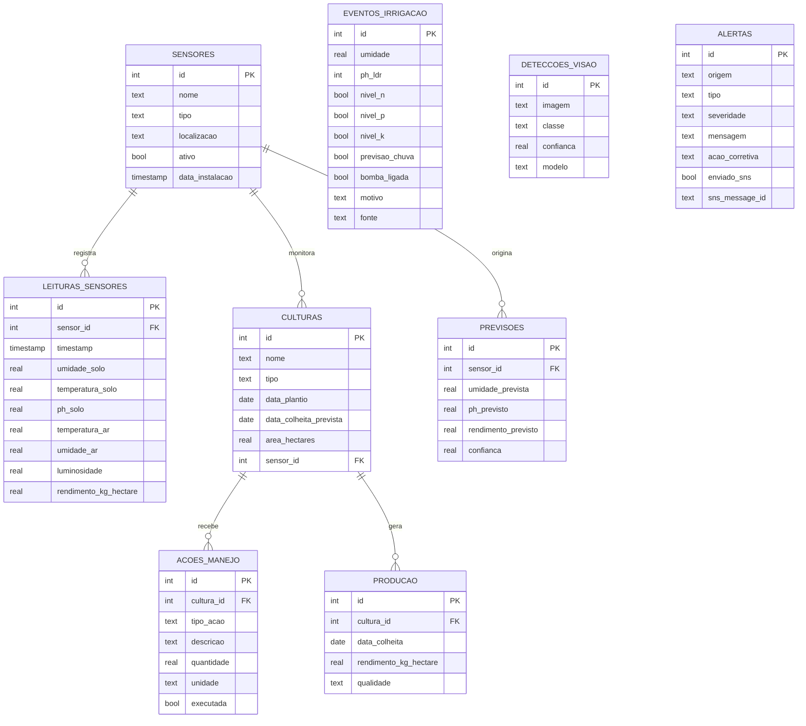

# Modelo de Dados — MER/DER (recuperação da Fase 3)

A entrega da Fase 3 (banco relacional com os dados de sensores) não havia
sido realizada; a Fase 7 a recupera com este modelo, implementado em SQLite
(operacional, `database/farmtech.db`) e com DDL Oracle equivalente
(`services/fase3_banco/ddl_oracle.sql`) para importação no Oracle SQL
Developer conforme o passo a passo do enunciado original.

## DER (diagrama entidade-relacionamento)

## Entidades e papel por fase

| Tabela | Fase de origem | Papel |
|---|---|---|
| sensores | 4 | Cadastro dos dispositivos IoT por talhão |
| leituras_sensores | 3/4 | Telemetria (umidade, pH, temperatura, etc.) |
| culturas | 1/4 | Talhões e áreas calculadas (Fase 1 grava aqui) |
| acoes_manejo | 4 | Recomendações do sistema especialista |
| producao | 4 | Histórico de colheitas |
| previsoes | 4 | Saídas dos modelos de ML |
| eventos_irrigacao | 2 (nova na F7) | Ciclos de decisão do ESP32/simulador |
| deteccoes_visao | 6 (nova na F7) | Detecções YOLO (maçã/garrafa) |
| alertas | 7 (nova) | Histórico da mensageria AWS SNS |

## Decisões de modelagem

Relação 1:N entre `sensores` e `leituras_sensores` mantém a telemetria
normalizada; `eventos_irrigacao`, `deteccoes_visao` e `alertas` são tabelas
de eventos sem FK rígida porque suas fontes (firmware ESP32, YOLO e motor
de alertas) operam de forma independente do cadastro de sensores — decisão
que simplifica a ingestão vinda do Wokwi/log da Fase 2.
